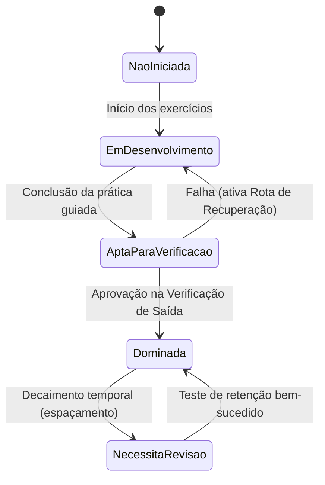

# Decisões de Arquitetura e Modelagem de Dados Pedagógicos

**Data de Emissão:** 14/09/2026  
**Etapa do Projeto:** Etapa 1 — Arquitetura Curricular Provisória (v01)  
**Produtor Responsável:** Antigravity  
**Revisor Designado:** Codex  
**Status do Documento:** Decisões Arquiteturais Formais  

---

## 1. Estruturação do Contrato Didático de 14 Itens

A produção autoral das aulas integra um contrato didático uniforme e exaustivo de 14 itens, projetado para transformar gravações audiovisuais e partituras em experiências ativas de prática deliberada.

### 1.1. Modelagem em Esquema JSON Normalizado
Cada aula curada é representada como um documento JSON validado por `SCHEMAS/aula-pedagogica.schema.json`. Os 14 itens distribuem-se nas seguintes propriedades estruturadas:

1. **Identificação e Enquadramento:** `id`, `versao`, `titulo`, `moduloPedagogicoId`, `habilidadePrincipalId`, `habilidadesSecundarias`, `nivel`, `fontesOrigem`.
2. **Item 1 — Objetivo Observável:** `objetivoObservavel` (string contendo comportamento mensurável, critérios de performance e condições de teste).
3. **Item 2 — Verificação de Entrada:** `entrada` (objeto com `tarefaVerificacao`, `respostaEsperada`, `rotaAlternativa`).
4. **Item 3 — Explicação Conceitual Concisa:** `explicacao` (objeto com `conceito`, `exemploConcreto`, `termosDefinidos`, `ligacaoMusical`).
5. **Item 4 — Demonstração Orientada:** `demonstracao` (objeto com `recursoId`, `orientacaoEscutaObservacao`, `trechoOuPagina`).
6. **Item 5 — Prática Guiada em 3 Tempos:** `praticaGuiada` (objeto com `exemploResolvido`, `tentativaComAjuda`, `tentativaIndependente`).
7. **Item 6 — Tríade de Exercícios:** `preparacaoAlvoVariacao` (objeto com `preparacao`, `alvo`, `variacao`).
8. **Item 7 — Especificação Técnica Executável:** `exercicioExecutavel` (objeto com `notasOuAcordes`, `cordasCasas`, `ritmoCompasso`, `andamentoBPM`, `dedosMao`).
9. **Item 8 — Antecipação de Erros:** `feedback` (objeto contendo array `errosPlausiveis`, cada qual com `erro`, `sinalObservavel`, `causaProvavel`, `intervencao`).
10. **Item 9 — Aplicação Musical Imediata:** `aplicacao` (objeto com `contextoMusical`, `repertorioTrecho`).
11. **Item 10 — Verificação de Saída:** `saida` (objeto com `tarefaIndependente`, `rubricaObservavel`, `criterioAprovacao`).
12. **Item 11 — Recuperação Imediata:** `recuperacao` (objeto com `simplificacao`, `alertaErgonomia`, `exercicioDescompressao`).
13. **Item 12 — Retenção e Transferência:** `retencaoTransferencia` (objeto com `tarefaPosterior`, `intervaloSugeridoDias`).
14. **Item 13 e 14 — Desenho de Sessão e Registro:** `sessaoRegistro` (objeto com `duracaoSugeridaMinutos`, `fasesSessao`, `checklistAutoavaliacao`).

---

## 2. Separação Estrita entre Auto-Índice e Curadoria Manual

Para proteger o sistema contra corrupção acidental e garantir repetibilidade, adota-se o princípio da **Arquitetura em Duas Camadas Desacopladas (CQRS / Ingestão vs. Domínio)**:

```
+-------------------------------------------------------------+
|           CAMADA 1: INGESTÃO E AUTO-ÍNDICE (READ-ONLY)       |
|  - C:\Users\wmors\Videos\KatoMart Acelerado (Acervo Bruto)   |
|  - producao/etapa-0-inventario/v02/ARQUIVOS-FISICOS.json     |
|  - producao/etapa-0-inventario/v02/INVENTARIO.json          |
|  * Geração puramente determinística e programática          |
|  * Chaves imutáveis: arq-XXXX, aula-mod-X-X, aula-kaiser-X  |
+-------------------------------------------------------------+
                              |
                              | (Chaves estrangeiras imutáveis)
                              v
+-------------------------------------------------------------+
|           CAMADA 2: DOMÍNIO PEDAGÓGICO CURADO (AUTORAL)      |
|  - producao/etapa-1-curriculo/v01/MAPA-HABILIDADES.json     |
|  - producao/etapa-1-curriculo/v01/AULAS-PROPOSTAS.json       |
|  - producao/etapa-1-curriculo/v01/MATRIZ-FONTE-AULA.csv      |
|  * Edição autoral deliberada orientada a evidências          |
|  * NUNCA sobregravada por reindexações da Camada 1          |
+-------------------------------------------------------------+
```

### Regras de Ouro de Isolamento:
1. **Unidirecionalidade:** Scripts de reindexação do acervo leem o sistema de arquivos e geram os manifestos brutos (`ARQUIVOS-FISICOS.json`), mas **nunca** tocam em arquivos do currículo (`MAPA-HABILIDADES.json` ou `AULAS-PROPOSTAS.json`).
2. **Ponte via Matriz Exaustiva:** A ligação entre as duas camadas ocorre exclusivamente pela `MATRIZ-FONTE-AULA.csv`, onde cada uma das 631 entradas tem seu destino pedagógico formalmente catalogado.

---

## 3. Versionamento Curricular e Integridade

1. **SemVer para Currículo e Schemas:**
   * **Major (X.0.0):** Alteração no grafo DAG de habilidades que quebre pré-requisitos existentes ou reestruturação dos 13 módulos.
   * **Minor (x.Y.0):** Adição de nova aula curada, enriquecimento de recursos complementares ou inclusão de novos exercícios.
   * **Patch (x.y.Z):** Correção de minutagem em fontes, ajustes textuais de rubricas ou correções tipográficas em materiais.
2. **Imutabilidade de Versões Publicadas:**
   * Diretórios como `v01/`, `v02/` são estritamente mantidos e preservados como snapshots históricos.
   * O arquivo `CONTROLE-LOTES.csv` centraliza a trilha de auditoria e status de cada versão entregue.

---

## 4. Rastreamento de Progresso por Habilidade (Grafo DAG)

### 4.1. Crítica à Métrica de "Aula Assistida"
No aprendizado instrumental, marcar uma aula como "concluída" apenas porque o arquivo de vídeo foi reproduzido é uma ilusão pedagógica perigosa. O aluno pode assistir passivamente a uma aula sobre pestana sem ser capaz de produzir uma única nota limpa no violão.

### 4.2. Modelo de Maestria Baseado em Grafo
O progresso do estudante é rastreado no nível atômico das habilidades do grafo DAG (`MAPA-HABILIDADES.json`):



* **Cálculo de Prontidão (Readiness):** Uma nova aula só se torna acessível se todos os nós de pré-requisitos em `prerequisitos` estiverem no estado `Dominada`.
* **Roteamento Inteligente de Falhas:** Se o estudante falha na verificação de saída de `aula-prop-005` (troca de acordes A-D), o sistema não repete o vídeo; ele analisa se o erro é postural (`hab-tec-001`), rítmico (`hab-rit-001`) ou motor e despacha a tarefa de recuperação específica do nó antecedente no DAG.

---

## 5. Esquema Relacional de Dados Pedagógicos (DDL / Tipagens)

```sql
-- Tabela de Habilidades Pedagógicas (Grafo DAG)
CREATE TABLE habilidade (
    id VARCHAR(32) PRIMARY KEY, -- ex: 'hab-rit-003'
    nome VARCHAR(128) NOT NULL,
    dominio VARCHAR(32) NOT NULL, -- 'ritmo', 'ouvido', 'leitura', 'tecnica', etc.
    acao_observavel TEXT NOT NULL,
    condicoes TEXT NOT NULL,
    evidencia_esperada TEXT NOT NULL,
    tarefa_diagnostica TEXT NOT NULL,
    rota_recuperacao TEXT NOT NULL
);

-- Tabela de Arestas do Grafo DAG de Pré-Requisitos
CREATE TABLE habilidade_prerequisito (
    habilidade_id VARCHAR(32) REFERENCES habilidade(id),
    prerequisito_id VARCHAR(32) REFERENCES habilidade(id),
    PRIMARY KEY (habilidade_id, prerequisito_id)
);

-- Tabela de Módulos Pedagógicos
CREATE TABLE modulo_pedagogico (
    id VARCHAR(32) PRIMARY KEY, -- ex: 'mod-ped-01'
    nome VARCHAR(128) NOT NULL,
    nivel VARCHAR(32) NOT NULL,
    descricao TEXT NOT NULL
);

-- Tabela de Aulas Curadas (Contrato Didático)
CREATE TABLE aula_pedagogica (
    id VARCHAR(32) PRIMARY KEY, -- ex: 'aula-prop-001'
    versao VARCHAR(16) NOT NULL DEFAULT '1.0.0',
    titulo VARCHAR(128) NOT NULL,
    modulo_id VARCHAR(32) REFERENCES modulo_pedagogico(id),
    habilidade_principal_id VARCHAR(32) REFERENCES habilidade(id),
    nivel VARCHAR(32) NOT NULL,
    decisao_editorial VARCHAR(32) NOT NULL,
    dados_contrato_json JSONB NOT NULL -- Contém os 14 itens validados pelo schema
);

-- Tabela de Vínculo com Fontes do Acervo Físico (Matriz 631)
CREATE TABLE matriz_fonte_aula (
    entrada_origem_id VARCHAR(64) NOT NULL,
    arquivo_id VARCHAR(32) NOT NULL,
    aula_proposta_id VARCHAR(32) REFERENCES aula_pedagogica(id),
    habilidade_id VARCHAR(32) REFERENCES habilidade(id),
    tipo_relacao VARCHAR(32) NOT NULL,
    nivel_inspecao VARCHAR(32) NOT NULL,
    PRIMARY KEY (entrada_origem_id, arquivo_id, aula_proposta_id)
);
```
