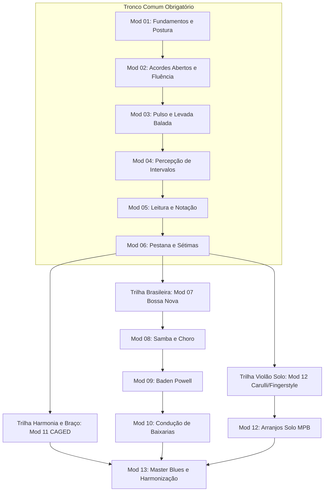

# Mapa Curricular e Arquitetura Pedagógica Integrada (Tríade + Kaiser)

**Data de Emissão:** 14/09/2026  
**Etapa do Projeto:** Etapa 1 — Arquitetura Curricular Provisória (v01)  
**Produtor Responsável:** Antigravity  
**Revisor Designado:** Codex  
**Status do Documento:** Provisório — Submetido para Validação  

---

## 1. Visão Pedagógica Integrada e Princípios de Fusão

O projeto de integração curricular **Tríade + Kaiser** une dois dos mais representativos acervos de ensino de violão em língua portuguesa, resolvendo uma dicotomia histórica no aprendizado do instrumento: a separação artificial entre a formação técnica/harmônica sistemática e a vivência do violão brasileiro com sua riqueza polifônica, rítmica e expressiva.

### 1.1. Papel dos Dois Cursos no Currículo
* **Método Tríade (Heitor Castro):** Fornece a espinha dorsal estrutural, motora e teórica. Destaca-se pela didática passo a passo, foco rigoroso na mecânica da mão esquerda (troca de acordes com dedo guia, ergonomia sem lesão), sistematização rítmica em compassos binários e quaternários, teoria aplicada diretamente no braço (intervalos, campo harmônico maior e menor, sistema CAGED) e introdução progressiva ao blues e improvisação.
* **Curso Kaiser (Violão Solo e Tradição Brasileira):** Fornece a substância artística, a identidade instrumental brasileira e a independência polifônica. Traz a leitura musical em clave de sol na primeira posição, o toque e as levadas inconfundíveis de Baden Powell (afrosambas), a condução sincopada de Bossa Nova (escola João Gilberto), o violão no samba e no choro, a condução melódica nos bordões (baixarias) e arranjos fingerstyle de nível clássico e popular.

### 1.2. O Problema Resolvido pela Fusão
A maioria dos cursos de violão sofre de dois extremos prejudiciais:
1. **O abismo da partitura acadêmica:** Métodos tradicionais focam em meses de solfejo e estudos clássicos em primeira posição sem permitir que o aluno acompanhe canções populares reais, gerando alta taxa de evasão.
2. **A superficialidade da "cifra solta":** Tutoriais rápidos de internet ensinam formas de acordes sem consciência motora, sem dedo pivô e sem fundamentação auditiva, levando o aluno a estagnar na primeira pestana e a sofrer com dores musculares por força excessiva.

O currículo integrado resolve essa falha articulando **fundamento mecânico rigoroso** com **aplicação musical de alto nível estético** desde o primeiro módulo.

---

## 2. Estrutura dos 13 Módulos Pedagógicos Provisórios

A arquitetura provisória é composta por 13 módulos pedagógicos coesos, distribuídos em cinco níveis de proficiência:

| Módulo ID | Nome do Módulo Pedagógico | Nível de Proficiência | Habilidade Central | Fontes Principais Integradas |
| :--- | :--- | :--- | :--- | :--- |
| **mod-ped-01** | 01. Fundamentos Ergonômicos, Postura e Primeiros Sons | Básico 1 | `hab-tec-001`, `hab-tec-002` | Tríade Mod 1 (postura, afinação, sons iniciais) |
| **mod-ped-02** | 02. Mecânica de Acordes Abertos e Fluência de Troca | Básico 1 | `hab-tec-003` | Tríade Mod 1 (A, D, E, Em, C, G; dedos-guia) |
| **mod-ped-03** | 03. Pulso, Subdivisão e Levadas Fundamentais | Básico 1 | `hab-rit-001`, `hab-rit-003` | Tríade Mod 1 e Kaiser Mod 1 (balada, pop, pulso) |
| **mod-ped-04** | 04. Percepção Auditiva e Reconhecimento de Intervalos | Básico 1 / Básico 2 | `hab-ouv-001`, `hab-ouv-002` | Tríade Mod 1 e Kaiser (ouvido relativo, 2ªs, 3ªs) |
| **mod-ped-05** | 05. Leitura Musical Integrada (Cifra, Tablatura e Partitura) | Básico 1 / Básico 2 | `hab-lei-001` a `hab-lei-003` | Kaiser Mod 8 (partituras fáceis) e Tríade Mod 1/2 |
| **mod-ped-06** | 06. Pestana sem Lesão e Acordes com Sétima | Básico 2 | `hab-tec-005` | Tríade Mod 3/5 e Kaiser (alavanca, tétrades) |
| **mod-ped-07** | 07. A Alma Brasileira I — Bossa Nova e João Gilberto | Básico 2 / Interm. 1 | `hab-rit-005` | Tríade Mod 5/6 e Kaiser (síncopa, acordes invertidos) |
| **mod-ped-08** | 08. A Alma Brasileira II — Samba, Choro e Baião | Intermediário 1 | `hab-rit-006` | Kaiser Mod 10/11 e Tríade Mod 6 (batucado, baião) |
| **mod-ped-09** | 09. O Universo de Baden Powell (Levadas e Afrosambas) | Intermediário 1 | `hab-rit-007` | Kaiser Mod 2/11 (5 levadas de Baden, afrosambas) |
| **mod-ped-10** | 10. Condução de Baixos e Baixarias (6 e 7 Cordas) | Intermediário 1/2 | `hab-aco-002` | Kaiser Mod 3/4 e Tríade Mod 7 (bordões melódicos) |
| **mod-ped-11** | 11. O Braço Panorâmico — Sistema CAGED e Voicings Drop 2 | Intermediário 2 | `hab-har-002` | Tríade Mod 3/4 e Kaiser (5 regiões, inversões) |
| **mod-ped-12** | 12. Violão Solo e Arranjo Fingerstyle | Intermediário 1 a Av. | `hab-sol-001`, `hab-sol-002` | Kaiser Mod 9/11 (Carulli, Cano, Baden solo) |
| **mod-ped-13** | 13. Nível Master — Expressão, Blues e Harmonização | Avançado | Expressão e Criação | Tríade Mod 8 e Kaiser Master (rearmonização, solos) |

---

## 3. Progressão Recomendada vs. Exploração Livre

O design curricular adota o modelo **Tronco Comum Estruturado com Ramificação Temática Flexível**.

### 3.1. Tronco Comum Obrigatório (Módulos 01 a 06)
* **Objetivo:** Estabelecer as bases motoras, perceptivas e ergonômicas universais.
* **Política de Transição:** Rigorosamente sequencial. O estudante não pode pular para o Módulo 06 (Pestana) sem demonstrar maestria comprovada em `hab-tec-003` (Troca Fluente de Acordes Abertos) e `hab-rit-003` (Levada Balada com Pulso Isócrono).
* **Justificativa Pedagógica:** A tentativa prematura de executar pestanas ou ritmos sincopados sem fluência nos acordes básicos gera compensações motoras errôneas (força de pinça excessiva no polegar esquerdo), culminando em tendinites e abandono precoce.

### 3.2. Exploração Livre e Trilhas Temáticas (Módulos 07 a 13)
Após a conclusão com êxito do Módulo 06, o estudante desbloqueia três trilhas de aprofundamento, podendo cursá-las em paralelo ou conforme seu foco de interesse estético:
1. **Trilha da Música Popular Brasileira (Módulos 07, 08, 09, 10):** Dedicada aos ritmos e levadas nacionais (João Gilberto, Baden Powell, samba tradicional, choro, baião e condução de baixos).
2. **Trilha de Violão Solo e Arranjo Fingerstyle (Módulo 12):** Focada na polifonia a duas vozes, partitura clássico-popular e independência de polegar e dedos para tocar melodia, harmonia e baixo simultaneamente.
3. **Trilha de Harmonia Moderna, Sistema CAGED e Blues (Módulos 11 e 13):** Voltada para o mapeamento integral do braço, inversões de tétrades, cadências harmônicas, escalas pentatônicas e improvisação.

---

## 4. Regras de Transição Pedagógica e Mastery Learning

O avanço no curso é governado pelo princípio de **Aprendizado para Maestria (Mastery Learning)**, em que o tempo é a variável flexível e o nível de proficiência é a constante inegociável.

### 4.1. Condições de Aprovação e Desbloqueio
1. **Aprovação na Verificação de Saída:** Cada aula propõe uma tarefa de saída independente e objetiva (ex.: executar 8 compassos contínuos a 60 BPM com tolerância zero para paradas de pulso). A aprovação é binária (Apto / Em Desenvolvimento).
2. **Readiness Score no Grafo DAG:** Uma aula só é elegível para início quando todas as habilidades pré-requisitas imediatas em `MAPA-HABILIDADES.json` apresentarem status `dominada`.
3. **Travamento Ergonômico Preventivo:** Caso o estudante relate ou identifique em sua autoavaliação dor muscular aguda no punho, dedos ou antebraço esquerdo, o sistema bloqueia imediatamente o avanço de módulo e orienta para a **Rota de Recuperação e Descompressão Ergonômica**, exigindo pausa mínima de 24 horas antes de nova tentativa.
